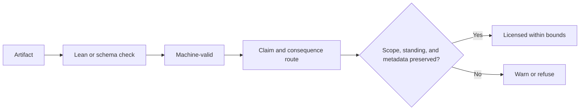

# Claim Fidelity

[](https://github.com/submit77/claim-fidelity/actions/workflows/verify.yml)

**A checked prototype for separating machine validity from licensed inference.**

Claim Fidelity is an experimental formal-methods artifact about how symbolic objects license—or fail to license—downstream claims and consequences. It is a curated public extraction from a longer independent research program in formal symbolic systems. Its most mature surfaces are:

- a buildable Lean 4 library for scope, binding, recognition authority, consequence licensing, route composition, metadata preservation, and drift;
- JSON schemas and a validator for records that carry source status, scope, standing, licensed consequences, blocked consequences, and claim ceilings;
- positive, warning, and refusal fixtures that test whether the validator accepts bounded routes and rejects or flags overreach;
- generated standalone Lean bundles with drift checks against their canonical imported modules.

The project is research infrastructure, not a completed theory of symbolic systems and not empirical validation that its formal vocabulary maps onto natural or deployed systems. The Lean namespace, schemas, and historical records retain the internal `FSST` name so that the checked artifact remains traceable to its source lineage.

## Quick verification

Prerequisites:

- Python 3.11 or newer;
- [elan](https://github.com/leanprover/elan), which supplies the Lean toolchain pinned in `formal/lean/lean-toolchain`.

Install the two pinned Python validation dependencies:

```text
python -m pip install -r requirements.txt
```

From the repository root:

```text
python scripts/run_formal_verification_checks.py --skip-axle
```

This local gate runs:

1. `lake build` for the default `Core` and `Theorems` targets;
2. positive and expected-negative compiler-record regression cases;
3. the compact claim-gap demonstration against a real refusal fixture;
4. repository integrity and import-coverage checks;
5. generated-bundle drift checks;
6. direct Lean checks of both generated standalone bundles.

On 2026-07-11, the local gate completed with:

```text
PASS lake build (32 jobs)
PASS compiler record checks (9 cases, 0 harness failures)
PASS claim-gap demo (schema-valid artifact refused at the claim layer)
PASS repo integrity audit (6 checks, 0 failures)
PASS two bundle drift checks
PASS two direct generated-bundle Lean checks
Summary: 8 top-level checks, 0 failures
```

Warnings from the Lean unused-variable linter remain. Expected-negative JSON fixtures intentionally emit schema failures or guardrail warnings; the harness passes when those fixtures are refused as specified.

## 60-second claim-gap demo

The smallest runnable example shows why machine validity and claim fidelity are different checks. A real cross-record fixture is valid under the declared JSON schema, but attempts to authorize data collection after losing scope and blocked-consequence metadata and routing through a recognizer whose standing is unresolved.



```text
python scripts/run_claim_gap_demo.py
```

Expected result:

```text
MACHINE CHECK   PASS — artifact is schema-valid
CLAIM CHECK     REFUSE — attempted consequence exceeds the licensed route
CONTROL         preserve required metadata and require established standing
DEMO RESULT     PASS — validity/claim gap detected
```

The demo is intentionally small, uses the same validator and versioned schema as the regression harness, and exits nonzero if the expected gap is not detected. See [`examples/CLAIM_GAP_DEMO.md`](examples/CLAIM_GAP_DEMO.md) for the claim–mechanism–control reading.

## Lean surface

The canonical Lean project is under `formal/lean/`:

```text
formal/lean/Core.lean
formal/lean/Theorems.lean
formal/lean/Core/
formal/lean/Theorems/
formal/lean/Bundles/
```

The tracked canonical surface contains 32 Lean files and 148 theorem declaration lines, with no `sorry` tokens or explicit `axiom` declarations in the audited files. Counts describe source shape, not mathematical novelty or empirical confirmation.

Representative modules:

- `Core/ConsequenceLicensing.lean` — scope, standing, and consequence-license predicates;
- `Core/RouteLicensed.lean` — route licensing across authority and policy;
- `Core/CrossRecordRoute.lean` — metadata preservation across records;
- `Core/RealityCoupling.lean` — formal predicates for coupling and drift;
- `Theorems/DriftCoupling.lean` — bounded theorems connecting drift predicates.

Many theorems are definitional consequences of stipulated structures. A successful Lean build establishes type correctness and proof checking inside those definitions; it does not establish that the definitions correctly model the world.

## Compiler-record surface

Schemas live in `docs/schemas/`. Example records and refusal fixtures live in `docs/formation/compiler_records/`.

The validator is designed to keep several distinctions explicit:

- source status versus downstream authority;
- valid local consequence versus prohibited scope extension;
- established, restricted, unresolved, and contested standing;
- licensed versus blocked consequences;
- metadata preserved versus stripped during composition;
- formal validity versus claim ceiling.

Run only the compiler-record regression suite with:

```text
python scripts/run_compiler_record_checks.py
```

## Repository map

- `formal/lean/` — canonical Lean source and generated standalone bundles;
- `scripts/` — verification, validation, generation, and integrity tooling;
- `examples/` — short reviewer-facing demonstrations over checked repository artifacts;
- `docs/schemas/` — versioned compiler-record schemas;
- `docs/formation/` — curated slice of the chronological implementation record: the compiler-record corpus (`compiler_records/`, required by the verification harness) plus the six documents (31–36) covering route licensing, Lean import architecture, verification-pipeline hardening, route composition, drift review, and the repo-integrity sweep.

This public repository is a curated extraction of a larger private working repository; the fuller chronological theory corpus (earlier formation documents and `docs/foundation/`) is preserved privately as provenance. Historical machine-local paths in documents and audit records have been normalized to `<workspace>`.

For current status and claim boundaries, read [`docs/CURRENT_STATUS.md`](docs/CURRENT_STATUS.md) before relying on historical formation documents.

## Claim boundaries

This repository supports the following claims:

- the checked-out Lean project builds under its pinned toolchain;
- the local verification harness exercises the documented formal and JSON surfaces;
- the schemas can express and mechanically flag several classes of scope, standing, metadata, and consequence-license failure;
- the fixtures include deliberate failures and warnings, not only positive examples.

It does **not** establish:

- a complete or uniquely correct theory of symbolic systems;
- empirical validity of the formal predicates;
- that machine-checked theorem validity entails fidelity to an intended natural-language claim;
- production readiness or external adoption;
- that every historical document reflects the current implementation.

## Research trajectory

Claim Fidelity is prior apparatus, not the proposed fellowship result. The immediate empirical project would test when formally accepted artifacts fail to justify their accompanying claims as generators increasingly optimize against the verifiable proxy.

Two conditional extensions follow only if that core study produces discriminating evidence:

1. **Controlled rule worlds:** randomized, Lean-checked systems with explicit budgets for familiarity, retrieval, search, and proof depth, used to compare capacity-bounded rival mechanisms.
2. **Strategic-behavior audits:** application of the same claim–mechanism–control discipline to open evaluations of planning, scheming, deception, or situational awareness.

These are neither present repository claims nor promised deliverables. Their licensing results and stopping conditions are specified in [`docs/RESEARCH_TRAJECTORY.md`](docs/RESEARCH_TRAJECTORY.md).

## External AXLE checks

The verification script also contains an optional integration with an AXLE wrapper stored in a sibling private repository in the original development environment. That integration is not required for public local verification and is intentionally skipped by the quick-verification command above.

## License

Apache License 2.0 — see [`LICENSE`](LICENSE).
